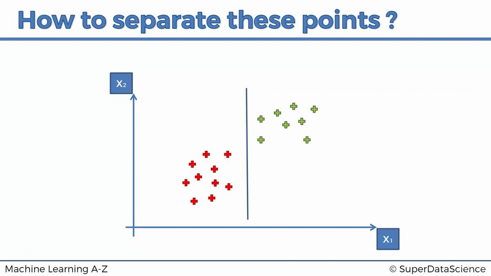

# ML Classifications
Prepared by Mahmoud Ahmedy, 3rd year CSE undergrad at FEE, Menoufia University.
## Table of Content
- [ML Classifications](#ml-classifications)
  - [Table of Content](#table-of-content)
  - [K Nearest Neighbors](#k-nearest-neighbors-classification)
    - [What it does for you](#what-it-does-for-you)
    - [Algorithm](#algorithm)
      - [Distance Functions](#distance-functions)
    - [Pros and Cons](#pros-and-cons)
    - [Example](#example)
    - [Code](./KNN)
  - [Support Vector Machine](#support-vector-machine-classification)
    - [Algorithm](#algorithm-1)
    - [Pros and Cons](#pros-and-cons-1)
    - [Example](#example-1)
    - [Code](./SVM)

## K Nearest Neighbors Classification
K nearest neighbors is a simple algorithm that stores all available cases and classifies new cases based on a **similarity measure** (e.g., **distance functions**). KNN has been used in statistical estimation and pattern recognition already in the beginning of 1970’s as a non-parametric technique. 

### What it does for you?

### Algorithm
A case is classified by a majority vote of its neighbors, with the case being assigned to the class most common amongst its K nearest neighbors measured by a distance function. If K = 1, then the case is simply assigned to the class of its nearest neighbor. 

#### Distance functions
As shown in the figure below, Thr Minkowski function is a general form of distance function, so this will be used with aid of paramaeter q (p in python)

Steps:
- Step 1: Choose a number K of neighbors, K = 5
- Step 2: Take the K = 5 nearest neighbors of the new data point. according to the Euclidean distance. (in the figure above)
- Step 3: Among these K neighbors, count the number of data points in each category
- Step 4: Assign the new data point to the category where you counted the most neighbors

### Pros and Cons
- Pros
  - No assumptions about data — useful, for example, for nonlinear data
  - Simple algorithm — to explain and understand/interpret
  - High accuracy (relatively) — it is pretty high but not competitive in comparison to better supervised learning models
  - Versatile — useful for classification or regression
- Cons
  - Computationally expensive — because the algorithm stores all of the training data
  - High memory requirement
  - Stores all (or almost all) of the training data
  - Prediction stage might be slow (with big N)
  - Sensitive to irrelevant features and the scale of the data
### Example
Courtesy of SuperDataScience &copy; and Machine Learning A-Z &trade; course.

## Support Vector Machine Classification
A Support Vector Machine (SVM) performs classification by finding the **hyperplane** that **maximizes the margin between the two classes**. The vectors (cases) that define the hyperplane are the **support vectors**.

### Algorithm
- Step 1: Define an optimal hyperplane: maximize margin
- Step 2: Extend the above definition for non-linearly separable problems: have a penalty term for misclassifications.
- Step 3: Map data to high dimensional space where it is easier to classify with linear decision surfaces: reformulate problem so that data is mapped implicitly to this space.

### Pros and Cons
- Pros
  - Performs similarly to logistic regression when linear separation
  - Performs well with non-linear boundary depending on the kernel used
  - Handle high dimensional data well
- Cons
  - Susceptible to overfitting/training issues depending on kernel

### Example
Courtesy of SuperDataScience &copy; and Machine Learning A-Z &trade; course.

